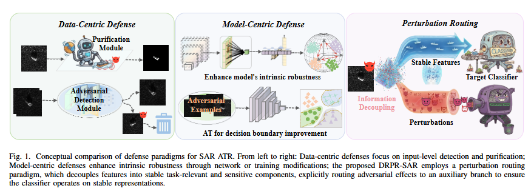

# 1. Introduction

DRPR-SAR addresses adversarial robustness in synthetic aperture radar (SAR) automatic target recognition (ATR). SAR ATR is often used in security-sensitive scenarios, where models are expected to maintain high recognition accuracy on clean samples while remaining reliable under adversarial perturbations, cross-scene variations, and complex backgrounds.

Existing defenses generally follow two paradigms. Model-centric defenses, such as adversarial training and architectural modification, aim to strengthen the classifier itself. Data-centric defenses, such as adversarial detection and input purification, attempt to identify or suppress perturbations before classification. Although these methods can reduce the effect of attacks, they usually lack explicit control over how adversarial effects are encoded inside the representation space.

The key difference of DRPR-SAR is that it does not treat robustness simply as perturbation suppression. Instead, it reformulates adversarial defense as perturbation routing. The basic observation is that adversarial perturbations mainly distort discriminative features close to the classification boundary, whereas comparatively redundant SAR information remains more stable and still preserves class semantics. Based on this observation, DRPR-SAR separates stable task-relevant information from perturbation-sensitive variations and routes attack-induced changes toward an auxiliary branch, allowing the final classifier to rely more on stable representations.

This forms a clear problem-to-method logic: identify the limitations of conventional defense paradigms, exploit the difference between stable and sensitive information in SAR representations, and build a robust recognition framework through representation decoupling, perturbation routing, and knowledge distillation.

Fig. 1 shows a conceptual comparison of three defense paradigms for SAR ATR. Data-centric defenses mainly perform detection or purification at the input level, model-centric defenses enhance the classifier through network or training strategies, while DRPR-SAR starts from the representation space, decouples stable task-relevant information from perturbation-sensitive variations, and actively routes perturbations to an auxiliary branch.

