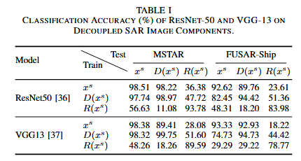

# 2. Method

This section introduces the logic of DRPR-SAR: why representation decoupling is needed, how decoupling and perturbation routing are implemented, and how the classification ability of different components supports the design.

## 2.1 Motivation for Representation Decoupling

Fig. 2.1 shows the visualization of adversarial perturbations in the decoupled representation space. Adversarial perturbations do not uniformly corrupt all information in SAR images. Discriminative features closely related to the final decision boundary are more easily disturbed, while redundant information remains comparatively stable and still preserves predictive class cues. This observation motivates DRPR-SAR to move from perturbation suppression to perturbation routing.

## 2.2 Overall Framework

Fig. 2.2 shows the overall framework of DRPR-SAR. The method consists of two stages. In the first stage, a task-guided decoupling module (TGDM), implemented with a rotation-enhanced VQ-VAE, decomposes each SAR image into a redundant stream and a discriminative stream. In the second stage, adversarial fine-tuning introduces dynamic perturbation routing, which encourages attack-induced variations to concentrate in the discriminative stream, while knowledge distillation guides the redundant-stream classifier to preserve class semantics learned from a clean teacher model.

During inference, the model mainly relies on the redundant stream for classification. The discriminative stream absorbs and represents perturbation-sensitive variations, while the redundant stream provides a more stable representation for target recognition. The paper further explains the stability of the redundant stream and the effectiveness of perturbation routing from the perspectives of classification margin, local sensitivity, and perturbation response.

## 2.3 Classification Ability of Decoupled Components

Fig. 2.3 shows the classification accuracy of different decoupled components. The results indicate that the redundant stream is not useless background information; it still contains class semantics useful for SAR ATR. The discriminative stream is more closely related to the decision boundary and is more likely to carry attack-induced variations. This supports the key assumption of DRPR-SAR: if stable information and perturbation-sensitive information can be separated, the robust classifier can be built on a more stable representation.

