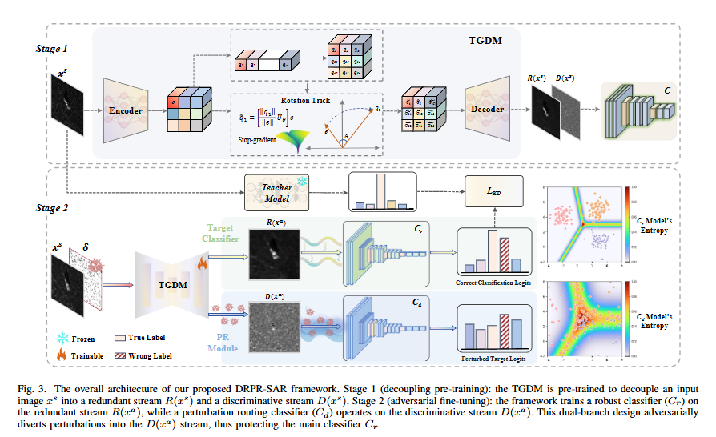
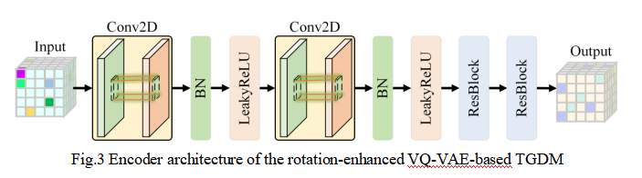

# 2. Method

This section introduces DRPR-SAR from two perspectives. Section 2.1 presents the observation analysis that motivates representation decoupling, and Section 2.2 describes the overall method, including the DRPR-SAR framework and TGDM.

## 2.1 Observation Analysis

Fig. 2.1 shows the visualization of adversarial perturbations in the decoupled representation space. Adversarial perturbations do not uniformly corrupt all information in SAR images. Discriminative features closely related to the final decision boundary are more easily disturbed, while redundant information remains comparatively stable and still preserves predictive class cues. This observation motivates DRPR-SAR to move from perturbation suppression to perturbation routing.

Fig. 2.1 also includes the classification accuracy of different decoupled components. The results indicate that the redundant stream is not useless background information; it still contains class semantics useful for SAR ATR. The discriminative stream is more closely related to the decision boundary and is more likely to carry attack-induced variations. Together, these results support the key assumption of DRPR-SAR: if stable information and perturbation-sensitive information can be separated, the robust classifier can be built on a more stable representation.

## 2.2 Overall Method

Fig. 2.2 shows the overall framework of DRPR-SAR. The method consists of two stages. In the first stage, a task-guided decoupling module (TGDM), implemented with a rotation-enhanced VQ-VAE, decomposes each SAR image into a redundant stream and a discriminative stream. In the second stage, adversarial fine-tuning introduces dynamic perturbation routing, which encourages attack-induced variations to concentrate in the discriminative stream, while knowledge distillation guides the redundant-stream classifier to preserve class semantics learned from a clean teacher model.

During inference, the model mainly relies on the redundant stream for classification. The discriminative stream absorbs and represents perturbation-sensitive variations, while the redundant stream provides a more stable representation for target recognition. This design allows adversarial effects to be controlled in the representation space rather than simply suppressed at the input level.

Fig. 2.2 further illustrates the encoder architecture used in the rotation-enhanced VQ-VAE based TGDM. The encoder uses convolutional blocks, normalization, nonlinear activation, and residual blocks to extract latent SAR representations before quantization and reconstruction. This structure provides the basis for generating stable redundant information and perturbation-sensitive discriminative information, enabling the following perturbation routing stage to separate final recognition from attack-induced variations.
