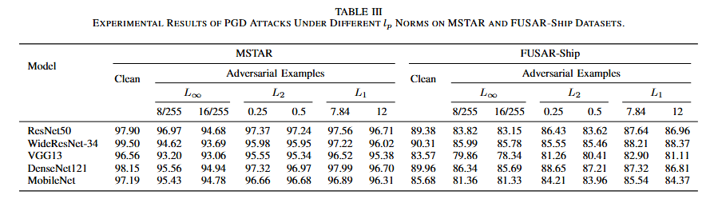
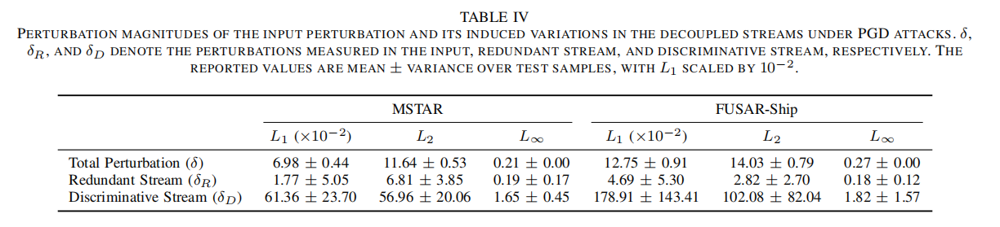

# 3.1 Quantitative Results

This folder summarizes the direct quantitative evidence for DRPR-SAR under PGD attacks and analyzes how perturbations are distributed across the decoupled streams.

Fig. 3.1 shows the performance of DRPR-SAR under PGD attacks constrained by different \(L_p\) norms on the MSTAR and FUSAR-Ship datasets. The model maintains high recognition accuracy under \(L_\infty\), \(L_2\), and \(L_1\) constraints, indicating that DRPR-SAR is not optimized for only one specific perturbation norm. In particular, on FUSAR-Ship, which contains more complex backgrounds and stronger sea clutter, the method still preserves stable robustness, suggesting that the decoupled representation adapts well to different perturbation forms.

Fig. 3.2 shows the input perturbation and its induced variations in the redundant and discriminative streams. The same input attack produces much larger variations in the discriminative stream than in the redundant stream after TGDM, indicating that adversarial effects are not evenly diffused across all representations but are intentionally guided to the branch more suitable for carrying perturbation-sensitive changes. This provides direct quantitative evidence for the perturbation routing mechanism.

