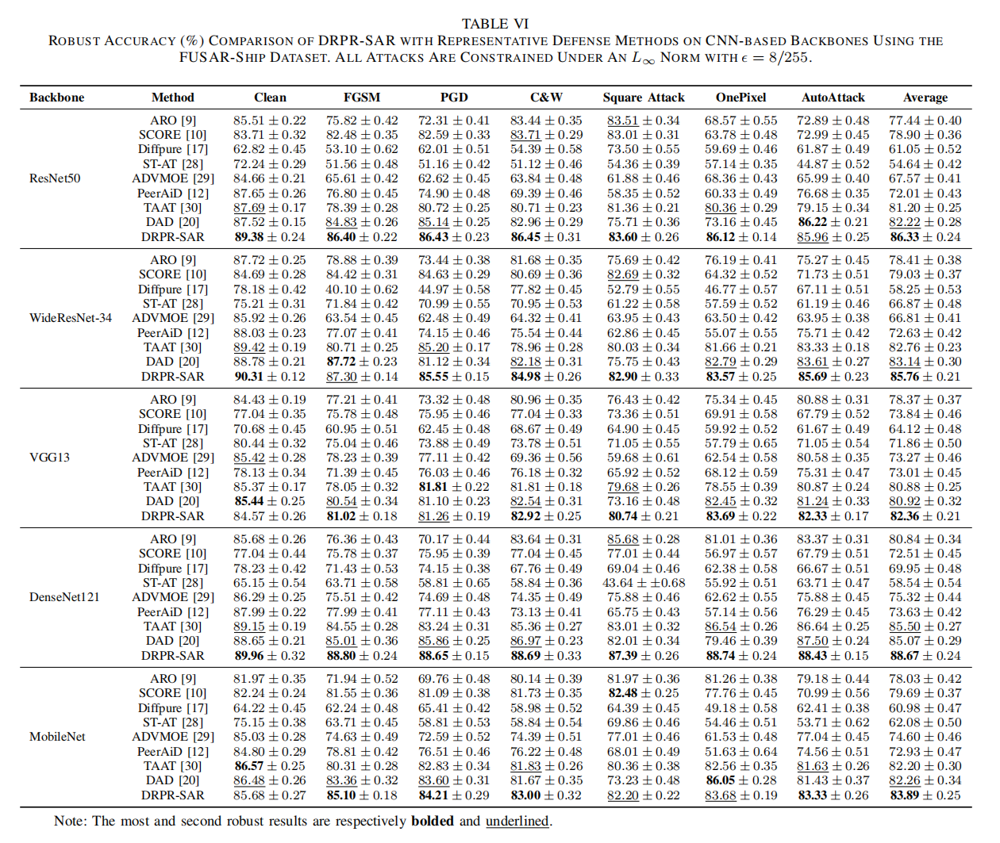
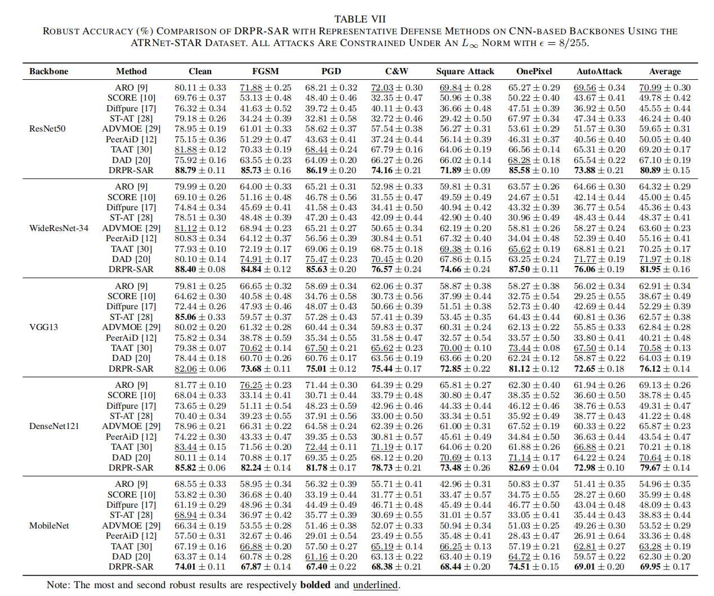

# 3.3 Comparative Experiment

This folder compares DRPR-SAR with representative defense methods on CNN and Transformer backbones across multiple SAR ATR datasets.

Table V reports CNN-based robust accuracy on MSTAR under both white-box attacks (FGSM, PGD, C&W, AutoAttack) and black-box/query-style attacks (Square Attack and OnePixel). The table compares DRPR-SAR with adversarial-training, purification, and distillation-based defenses across ResNet50, WideResNet-34, VGG13, DenseNet121, and MobileNet. Its role is to show that DRPR-SAR is not a backbone-specific improvement: the average robust accuracy remains strong across multiple CNN architectures on the standard SAR ground-target benchmark.

Table VI reports the same CNN-based comparison on FUSAR-Ship. This dataset is more challenging than MSTAR because ships vary in shape and size, and the background contains sea clutter, land patches, and non-ship regions. The table shows whether the proposed representation remains useful when the scene contains more distractors and fine-grained maritime categories. DRPR-SAR maintains competitive average robustness, indicating that the redundant stream preserves stable target information rather than merely suppressing or smoothing the input.

Table VII reports CNN-based robust accuracy on ATRNet-STAR. This benchmark introduces more categories and more complex SAR scenes, so it evaluates whether the method scales beyond the smaller standard settings. The consistent improvements across CNN backbones indicate that DRPR-SAR is not only effective on MSTAR and FUSAR-Ship, but also remains useful when the recognition problem becomes larger and more diverse. This supports the generality of representation-level perturbation routing.

Table VIII reports robust accuracy on Transformer architectures, including ViT-B, HiViT-B, and Swin-T. This table answers whether DRPR-SAR depends on CNN-specific inductive biases. The results show that the same decoupling and routing idea can be combined with Transformer feature extractors and still improve robustness across MSTAR, FUSAR-Ship, and ATRNet-STAR. This strengthens the claim that DRPR-SAR is a representation-level defense framework rather than a defense tied to a particular architecture family.

