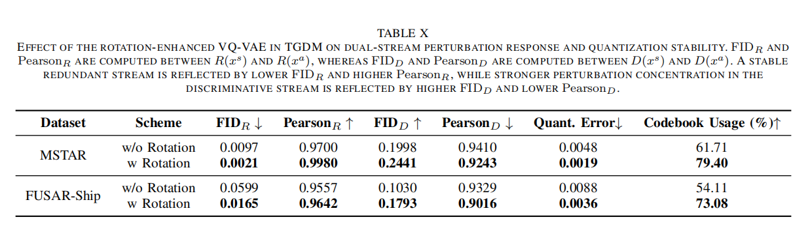

# 3.5 Ablation Study

This folder analyzes the contribution of individual modules in DRPR-SAR.

Table IX reports the ablation study under clean and PGD attack settings on MSTAR and FUSAR-Ship. It removes or adds key components including TGDM, rotation enhancement, the target classifier, perturbation routing, and knowledge distillation. The plain classifier has very low PGD robustness, showing that normal recognition alone is insufficient. Adding TGDM and the two-branch training objective substantially improves robustness, and the full configuration achieves the best overall result. This table demonstrates that DRPR-SAR works through component cooperation: TGDM creates a decoupled space, perturbation routing directs attack-induced variations, and distillation helps preserve clean class semantics.

Table X reports why the rotation-enhanced VQ-VAE is useful inside TGDM. It compares dual-stream perturbation response and quantization stability with and without the rotation trick. Lower \(FID_R\) and higher \(Pearson_R\) mean the redundant stream changes less under attack, while higher \(FID_D\) and lower \(Pearson_D\) mean the discriminative stream absorbs more perturbation-sensitive variation. The reduced quantization error and improved codebook usage further show that the rotation-enhanced design produces a more stable and expressive discrete representation. This table connects the architectural design of TGDM to the observed routing behavior.

