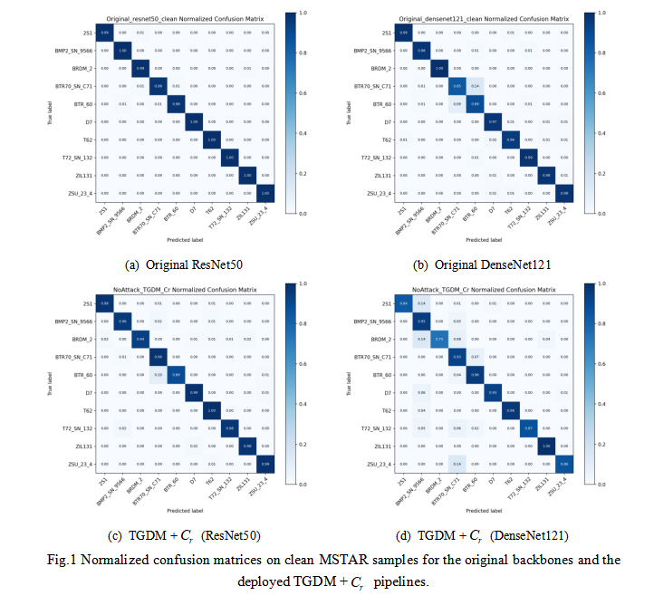
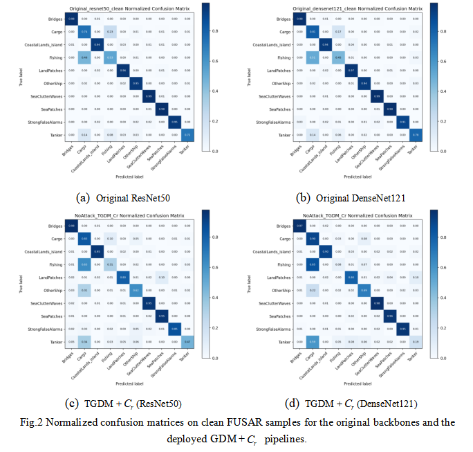

# 3.6 Supplementary Experiments

This folder contains additional results that further support the generality and deployability of DRPR-SAR.

Table XI reports the robust accuracy under the SAMPLE synthetic-to-measured setting. In this setting, models are trained on synthetic SAR images and tested on measured SAR images, where scattering characteristics, background clutter, and noise distributions differ across domains. DRPR-SAR still improves robustness under PGD, AutoAttack, and transfer-based attacks, suggesting that stable redundant representations help not only against adversarial perturbations but also under a certain degree of domain shift.

Table XII compares the clean accuracy of the original backbone and the deployed TGDM inference pipeline. This result addresses whether introducing the decoupling module significantly harms clean recognition. The clean accuracy remains within a reasonable range while robustness improves, indicating that the method does not simply trade normal recognition performance for adversarial robustness.

Fig. 8 shows normalized confusion matrices on clean MSTAR samples for the original ResNet50 and DenseNet121 backbones and their deployed `TGDM + C_r` pipelines. The diagonal-dominant patterns indicate that the decoupling-based inference pipeline largely preserves the class-discriminative structure on clean ground-target SAR samples, which supports the clean-accuracy comparison in Table XII.

Fig. 9 shows normalized confusion matrices on clean FUSAR samples for the original backbones and the corresponding `TGDM + C_r` pipelines. Compared with MSTAR, FUSAR contains more complex maritime categories and background interference, so some categories are naturally more confusable. Even so, the deployed pipeline maintains meaningful diagonal concentration, suggesting that TGDM does not destroy the clean-sample recognition behavior while introducing the representation structure needed for robust defense.

