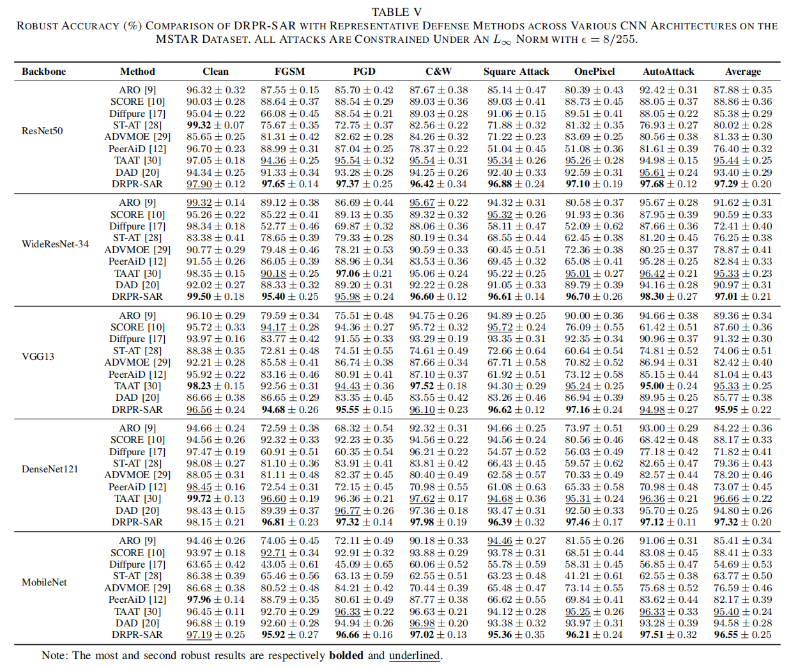
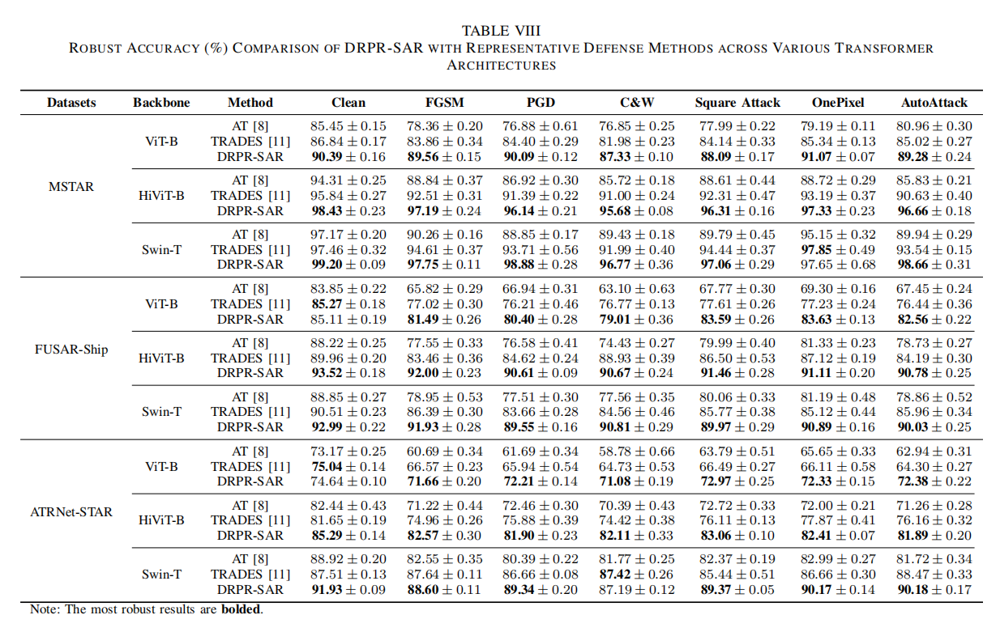
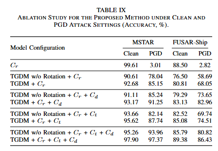
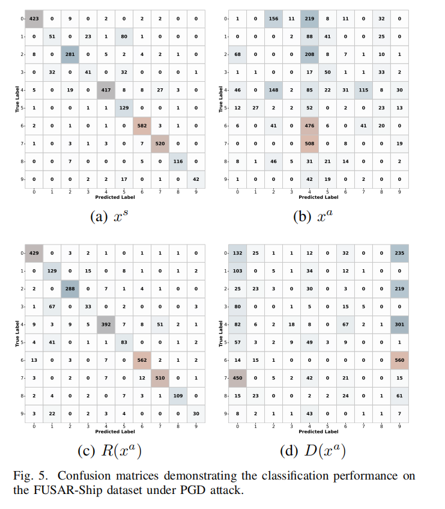

# 3. Experiments

This section is organized into three subfolders: `Comparative_Experiments`, `Ablation_Studies`, and `Visualizations`. The experimental logic is to first compare DRPR-SAR with representative defense methods, then analyze the contribution of different modules and parameter settings, and finally explain the perturbation routing mechanism through perturbation statistics, feature distributions, and confusion matrices.

## Comparative Experiments

The `Comparative_Experiments` folder reports the robust recognition performance of DRPR-SAR across different datasets, attack types, and model architectures.

Fig. 3.1 shows the performance of DRPR-SAR under PGD attacks constrained by different \(L_p\) norms on the MSTAR and FUSAR-Ship datasets. The model maintains high recognition accuracy under \(L_\infty\), \(L_2\), and \(L_1\) constraints, indicating that DRPR-SAR is not optimized for only one specific perturbation norm. In particular, on FUSAR-Ship, which contains more complex backgrounds and stronger sea clutter, the method still preserves stable robustness, suggesting that the decoupled representation adapts well to different perturbation forms.

Fig. 3.3 shows the CNN-based robust accuracy comparison on MSTAR. DRPR-SAR achieves strong average robustness across ResNet50, WideResNet-34, VGG13, DenseNet121, and MobileNet, and performs favorably under white-box and black-box attacks such as FGSM, PGD, C&W, Square Attack, OnePixel, and AutoAttack. This indicates that perturbation routing does not rely on a particular backbone or a single attack setting, but consistently improves resistance to adversarial perturbations in standard SAR ground-target recognition.

Fig. 3.4 shows the CNN-based robust accuracy comparison on FUSAR-Ship. Compared with MSTAR, FUSAR-Ship contains larger variations in ship appearance and is affected by sea clutter, non-ship regions, and complex backgrounds, making robust recognition more challenging. DRPR-SAR still achieves competitive average robust accuracy, showing that the redundant stream does not simply preserve background information but extracts stable SAR representations that remain discriminative in complex maritime scenes.

Fig. 3.5 shows the CNN-based robust accuracy comparison on ATRNet-STAR. ATRNet-STAR contains more categories, more complex scenes, and richer imaging conditions, making it useful for evaluating large-scale SAR ATR robustness. DRPR-SAR maintains stable improvements across multiple CNN backbones, suggesting that its benefit comes from representation-level information decoupling and perturbation routing rather than overfitting to a small dataset or a specific scenario.

Fig. 3.6 shows the robust accuracy comparison of DRPR-SAR on Transformer architectures, including ViT-B, HiViT-B, and Swin-T. Consistent with the CNN results, DRPR-SAR improves robustness under different attacks on Transformer backbones. This indicates that the core mechanism is not tied to convolutional local receptive fields, but can serve as a more general representation-level defense strategy for different feature extractors.

Fig. 3.13 shows the robust accuracy under the SAMPLE synthetic-to-measured setting. In this setting, models are trained on synthetic SAR images and tested on measured SAR images, where scattering characteristics, background clutter, and noise distributions differ across domains. DRPR-SAR still improves robustness under PGD, AutoAttack, and transfer-based attacks, suggesting that stable redundant representations help not only against adversarial perturbations but also under a certain degree of domain shift.

Fig. 3.14 compares the clean accuracy of the original backbone and the deployed TGDM inference pipeline. This result addresses whether introducing the decoupling module significantly harms clean recognition. The clean accuracy remains within a reasonable range while robustness improves, indicating that the method does not simply trade normal recognition performance for adversarial robustness.

## Ablation Studies

The `Ablation_Studies` folder analyzes the contribution of different modules and key hyperparameters in DRPR-SAR.

Fig. 3.7 shows the ablation results of TGDM, the target classifier, the perturbation routing branch, knowledge distillation, and rotation enhancement. When only the main classifier is used, robustness under PGD attack is weak. As TGDM, perturbation routing, and knowledge distillation are progressively introduced, robust accuracy improves noticeably. This demonstrates that DRPR-SAR is not driven by a single trick, but by the cooperation of three components: TGDM provides a separable representation space, perturbation routing guides attack-induced variations into the discriminative stream, and knowledge distillation helps the redundant stream preserve class semantics from the clean teacher.

Fig. 3.8 shows the effect of the rotation-enhanced VQ-VAE on dual-stream perturbation response and quantization stability. With rotation enhancement, the redundant stream has lower FID and higher correlation, indicating better stability before and after attack. The discriminative stream shows stronger perturbation response, which matches the goal of concentrating perturbation-sensitive variations in the auxiliary branch. Meanwhile, lower quantization error and higher codebook usage indicate that rotation enhancement also improves discrete representation learning in VQ-VAE.

Fig. 3.11 shows the sensitivity of robust accuracy on MSTAR to \(\lambda_{C_r}\) and \(\lambda_{PR}\). These two parameters control the redundant-stream classification constraint and the perturbation routing constraint, respectively. If the former is too weak, the final classifier loses semantic discrimination; if the latter is too weak, perturbations cannot be sufficiently guided into the discriminative stream. However, overly strong weights may also disturb the balance between the two streams. The performance surface shows that DRPR-SAR remains robust within a reasonable parameter range while requiring a proper balance between classification and routing objectives.

Fig. 3.12 shows the effect of the knowledge distillation weight \(\lambda_{KD}\) on FUSAR-Ship under different attacks. Knowledge distillation allows the redundant-stream classifier to inherit class semantics from a clean teacher, compensating for information loss caused by robust training and decoupling. An appropriate distillation weight achieves a better balance between clean accuracy and robustness, while too small a weight provides insufficient semantic constraint and too large a weight may overemphasize the teacher distribution and affect robust optimization.

## Visualization

The `Visualizations` folder explains the working mechanism of DRPR-SAR from three perspectives: perturbation distribution, feature space, and classification behavior.

Fig. 3.2 shows the input perturbation and its induced variations in the redundant and discriminative streams. The same input attack produces much larger variations in the discriminative stream than in the redundant stream after TGDM, indicating that adversarial effects are not evenly diffused across all representations but are intentionally guided to the branch more suitable for carrying perturbation-sensitive changes. This provides direct quantitative evidence for the perturbation routing mechanism.

Fig. 3.9 shows the t-SNE feature distribution on MSTAR under PGD attack. Clean features usually form clear class clusters, while adversarial examples disturb inter-class boundaries and make the distribution more entangled. After DRPR-SAR decoupling, the redundant stream \(R(x^a)\) better preserves the clean clustering structure, indicating that stable class semantics are retained. In contrast, the discriminative stream \(D(x^a)\) is more scattered, suggesting that perturbation-sensitive information is routed into the auxiliary branch.

Fig. 3.10 shows the confusion matrices on FUSAR-Ship under PGD attack. Comparing clean inputs, adversarial inputs, the redundant stream, and the discriminative stream shows that attacks significantly increase class confusion, while the redundant stream recovers more correct predictions and preserves more stable class discrimination in complex maritime scenes. The discriminative stream exhibits stronger confusion, further indicating that it carries more attack-induced sensitive variations.

