# DRPR-SAR 实验结果说明

本文件夹整理了 DRPR-SAR 的实验结果图片，主要包括攻击鲁棒性对比、扰动幅值分析、消融实验、特征可视化、超参数敏感性以及补充实验。

## 攻击设置与扰动分析

表 3 展示了 DRPR-SAR 在 MSTAR 和 FUSAR-Ship 数据集上面对不同 \(L_p\) 范数约束 PGD 攻击时的表现。结果用于验证方法在多种扰动强度和攻击约束下的稳定性。

表 4 进一步统计了输入扰动及其在冗余流、判别流中的诱导变化。实验结果说明，扰动经过解耦后会在不同分支中呈现差异化分布，为“扰动路由”机制提供了量化证据。

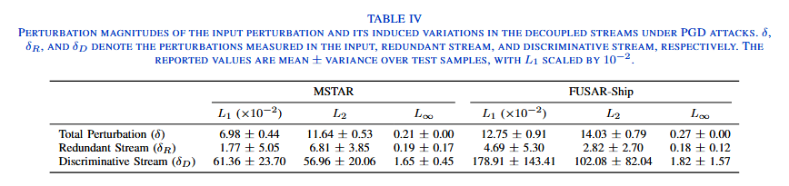

## 鲁棒准确率对比

表 5、表 6 和表 7 分别给出了 DRPR-SAR 在 MSTAR、FUSAR-Ship 和 ATRNet-STAR 数据集上，与多种代表性防御方法在 CNN 骨干网络上的鲁棒准确率对比。结果表明，DRPR-SAR 在 FGSM、PGD、C&W、Square Attack、OnePixel 和 AutoAttack 等攻击下整体表现更稳健。

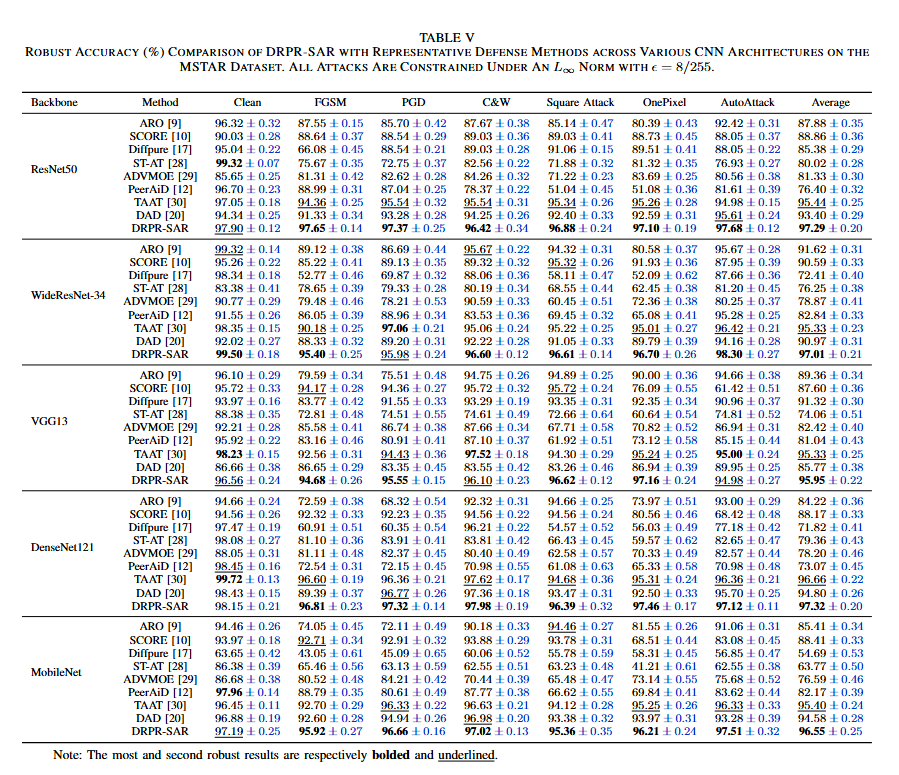

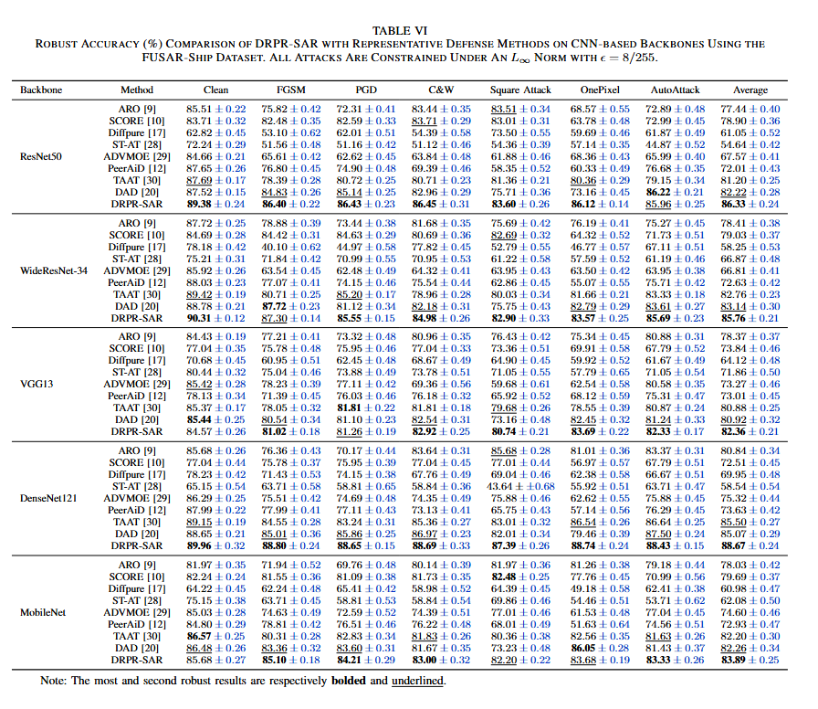

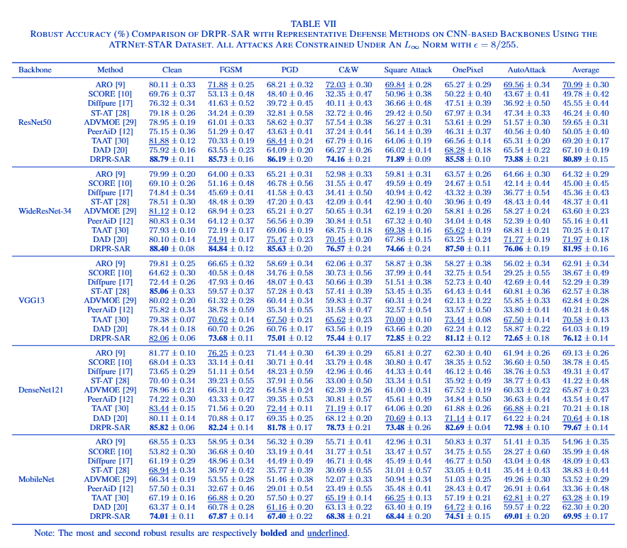

表 8 展示了在 ViT-B、HiViT-B 和 Swin-T 等 Transformer 架构上的鲁棒准确率对比，说明该方法不仅适用于 CNN，也能迁移到 Transformer 类模型。

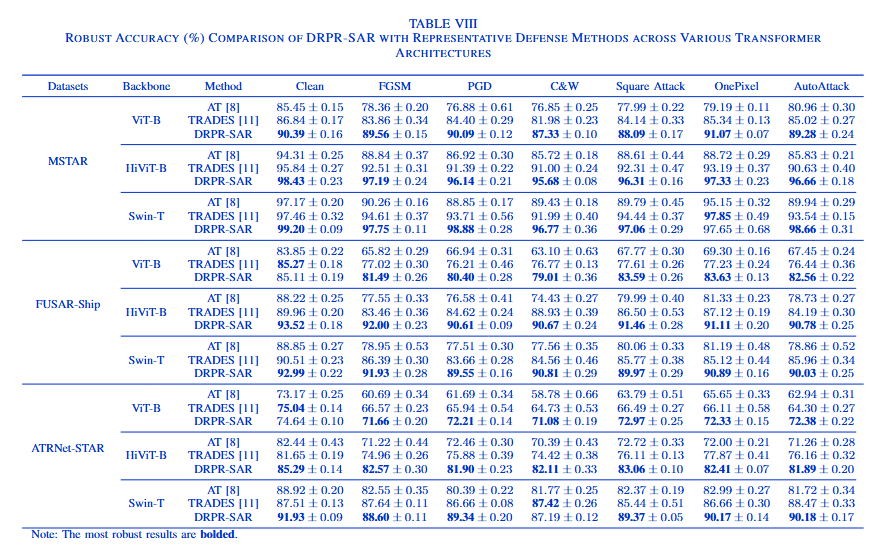

## 消融与模块分析

表 9 对 DRPR-SAR 的关键组件进行了消融分析，包括旋转增强、目标分类器、扰动路由分支和知识蒸馏分支等。结果说明，各模块共同提升了干净样本和 PGD 攻击场景下的识别性能。

表 10 分析了旋转增强 VQ-VAE 对双流扰动响应和量化稳定性的影响。结果显示，旋转增强有助于提升冗余流的稳定性，并改善码本使用率与量化误差。

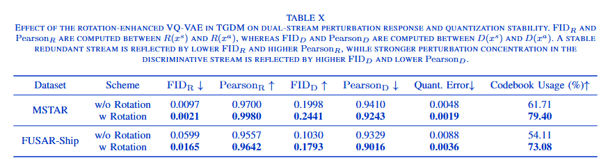

## 可视化与敏感性分析

图 4 使用 t-SNE 可视化了 MSTAR 数据集在 PGD 攻击下不同表示空间中的特征分布，用于观察冗余流和判别流对类别结构的保持情况。

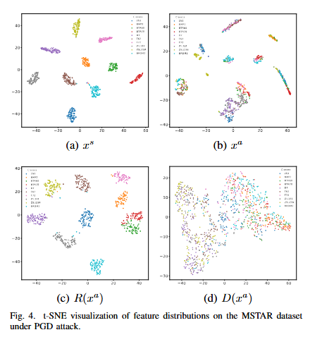

图 5 给出了 FUSAR-Ship 数据集在 PGD 攻击下的混淆矩阵，展示不同解耦表示在类别预测上的差异。

图 6 和图 7 分别分析了关键超参数以及知识蒸馏权重对鲁棒准确率的影响，用于说明方法在不同参数设置下的稳定性。

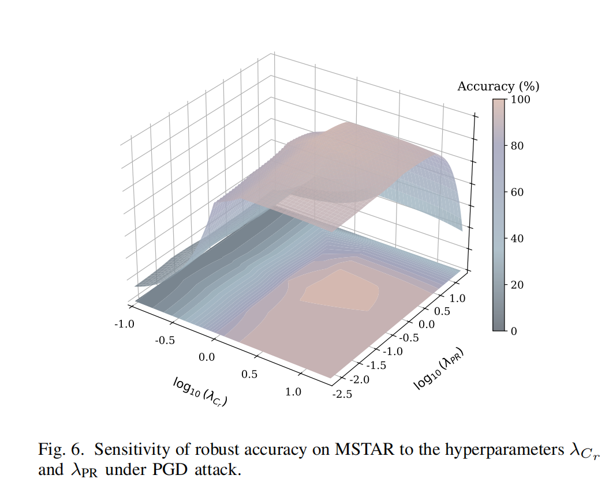

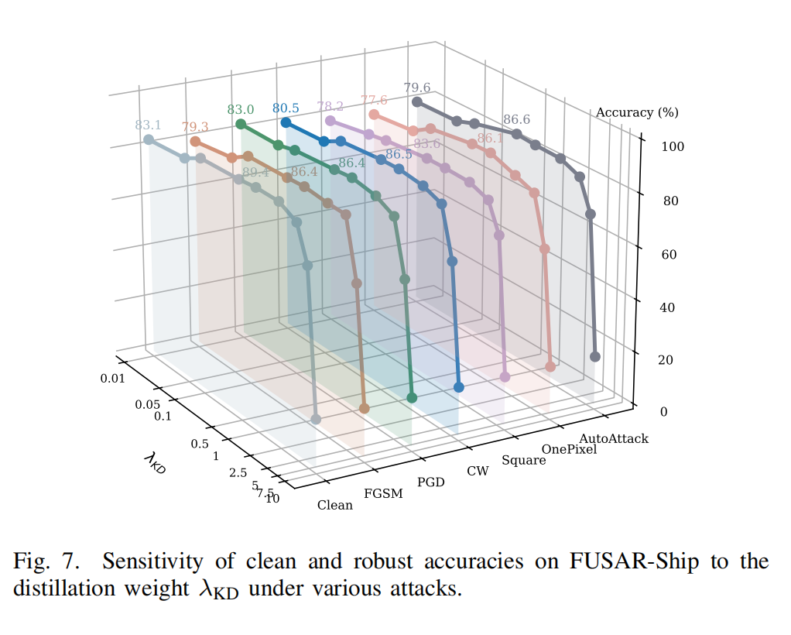

## 补充实验

补充表 1 展示了 SAMPLE synthetic-to-measured 设置下的鲁棒准确率，用于评估模型在合成到实测跨域场景中的泛化能力。

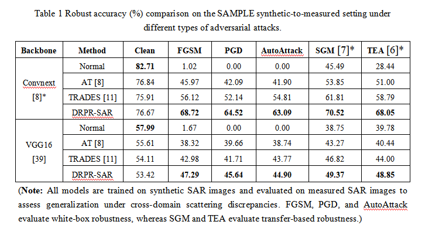

补充表 2 比较了原始骨干网络和部署 TGDM 后的干净准确率，说明 TGDM 推理流程在保持识别能力方面的影响。

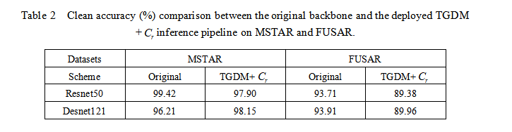
