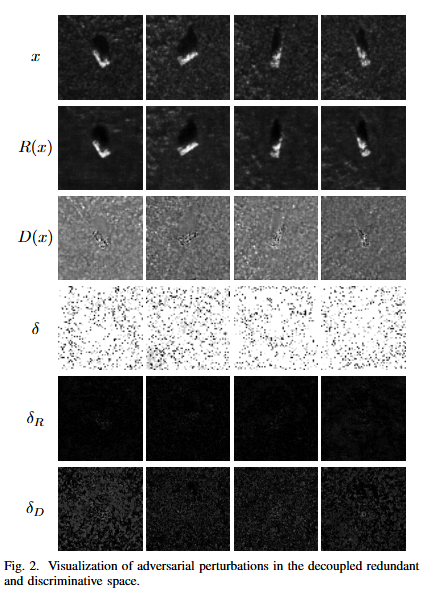

# DRPR-SAR 方法说明

本部分主要展示 DRPR-SAR 的方法设计，包括对抗扰动在解耦空间中的表现、整体框架结构，以及不同解耦分量对分类任务的贡献。

## 解耦空间中的扰动可视化

图 2 展示了原始 SAR 图像、冗余分量、判别分量以及对应扰动在不同空间中的分布情况。可以看到，对抗扰动并不是均匀影响所有信息，而是更容易破坏与分类决策强相关的判别性特征。相比之下，冗余分量中包含的结构信息更加稳定，这为后续利用冗余流提升鲁棒性提供了依据。

## 整体框架

图 3 给出了 DRPR-SAR 的整体架构。方法分为两个阶段：

1. 解耦预训练阶段：通过任务引导解耦模块（TGDM）将输入 SAR 图像分解为冗余流和判别流，使不同类型的信息进入不同表示空间。
2. 对抗微调阶段：在攻击样本下引入动态扰动路由机制，使扰动影响更多集中到判别流，同时让冗余流分类器通过知识蒸馏学习干净教师模型的类别语义。

这种设计的核心不是直接消除扰动，而是主动控制扰动在表示空间中的流向，从而保护主分类器所依赖的稳定语义信息。

## 解耦分量的分类能力

表 1 对比了 ResNet50 和 VGG13 在原始输入、冗余分量和判别分量上的分类准确率。结果表明，冗余分量虽然不直接等同于完整的判别特征，但仍保留了可用于目标识别的类别信息；判别分量则对分类边界更加敏感，也更容易受到对抗扰动影响。

这一结果支持了本文的基本假设：SAR 图像中的信息可以被拆分为相对稳定的冗余信息和对决策更敏感的判别信息。DRPR-SAR 正是利用这种差异，通过解耦和扰动路由提升对抗鲁棒性。

